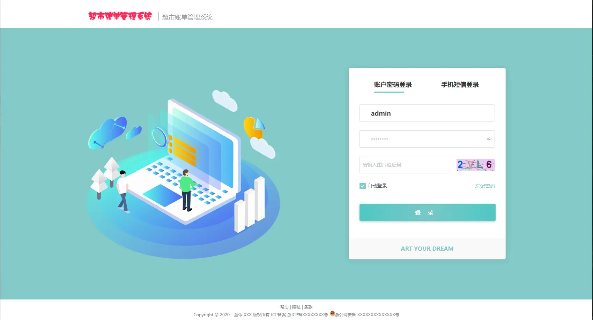
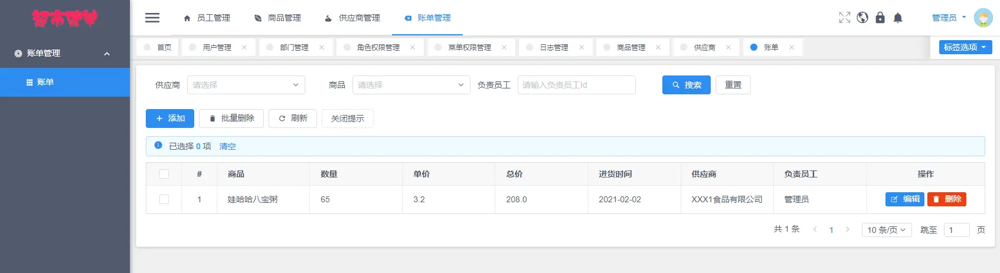
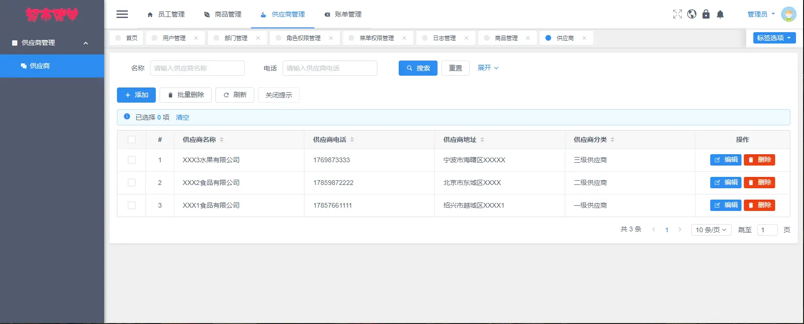
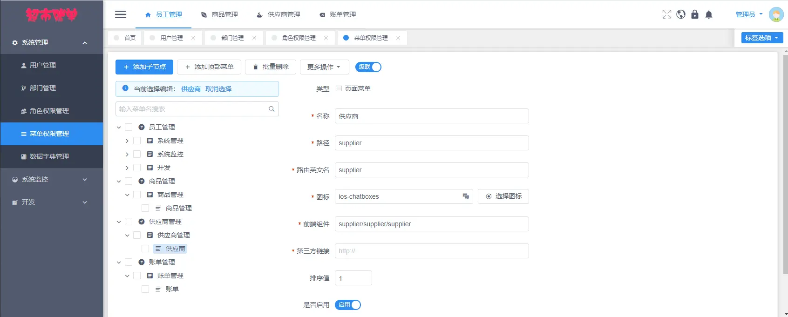
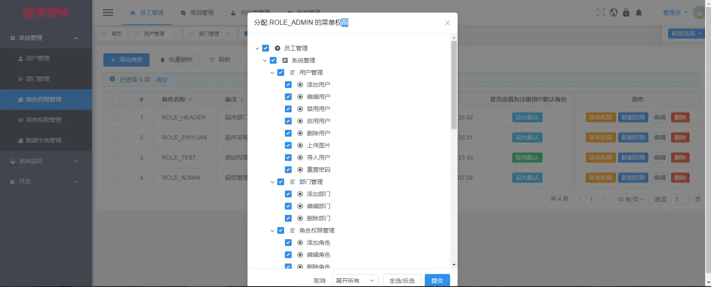
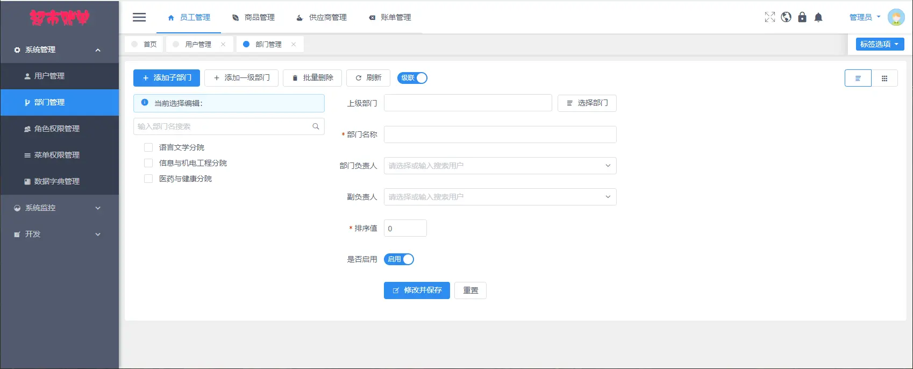
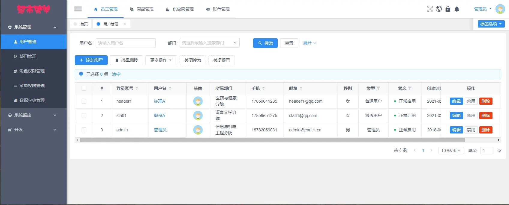

# 基于Vue和SpringBoot的超市账单管理系统



## 软件简介

本软件是《基于Vue和SpringBoot的超市账单管理系统》，支持**商品模块、供应商模块、账单模块**这三大核心业务，适用于小型超市管理商品账单，支持的功能如下。

- 系统基础管理：对登入用户、部门、角色、权限进行维护。
- 商品管理：对超市所出售的商品档案进行维护。
- 供应商管理：对超市所合作的供应商档案进行维护。
- 账单管理：对超市所管理的账单档案进行维护。  

系统前端采用 View UI 组件库，后端集成MyBatisPlus连接MySQL数据库，采用Spring Security做权限控制。

超市账单管理系统采用了**基于角色的访问控制**，角色和菜单关联，一个角色可以配置多个菜单权限；然后再将用户和角色关联，一位用户可以赋予多个角色。这样用户就可以根据角色拿到该有的菜单权限，更方便小型超市的管理人员进行权限管控。

## 软件技术选型

### 前端

Vue：Vue 是构建前端界面的核心框架，本系统采用 2.6.14 版本。

View UI：基于 Vue.js2.0 的组件库，本系统采用 4.7.0 版本。

### 后端

Spring Boot：构建系统核心逻辑的后端框架，本系统采用 2.7.0 版本。

MyBatis / MyBatis Plus：后端连接数据库的框架，本系统采用 3.5.2 版本。

### 数据库

MySQL：本项目的主数据库，本系统采用 8.0.29 版本。

Redis：本系统采用基于 Windows 版本的 Redis，用于图形验证码和用户菜单权限的临时存储，采用了 5.0.14 版本。

### 开发环境

VsCode：项目前端的开发工具，使用版本为 1.68.0。

IntelliJ IDEA ：项目后端的开发工具，使用版本为 2021.3.2。

Jdk：Java 的开发环境，使用版本为 17.0.3.1。

Maven：后端项目的打包工具，使用版本为 3.6.2。

NodeJs：前端项目的开发环境，使用版本为 16.13.0。

## 界面预览  

### 登入页面


### 账单管理模块



### 供应商管理模块



### 商品管理模块


### 菜单管理模块



### 权限管理模块



### 部门管理模块



### 员工管理模块



## 安装教程

1.本机安装GIT，输入命令

```java
git clone https://gitee.com/yyzwz/bill-system.git
```

2.前端使用 VsCode 打开front文件夹，控制台输入npm i 安装依赖

3.前端控制台输入npm run dev 运行（默认8080端口）

4.控制台 cd 到 redis 目录，运行以下命令

```java
redis-server.exe redis.windows.conf
```

5.导入数据库（bill.sql）

6.使用idea导入back后端项目，maven方式导入，运行(默认1314端口)！

7.运行项目，账号admin 密码123456

## 开发模板介绍

《基于 Vue 和 SpringBoot 的超市账单管理系统》是基于《基于 Vue 和 SpringBoot 的通用管理系统》开发的，模板包含了**登陆注册、用户管理、部门管理、文件管理、权限管理、日志管理、个人中心、数据字典和代码生成**这九个功能模块，另外还有两张样例数据表和五张样例数据图，是一个很好的前后端分离开发模板，开发者可以在这个模板上进行二次开发，只需要实现需求方的业务逻辑，即可快速成型甲方的业务需求。

模板采用了**基于角色的访问控制**，角色和菜单关联，一个角色可以配置多个菜单权限；然后再将用户和角色关联，一位用户可以赋予多个角色。这样用户就可以根据角色拿到该有的菜单权限，更方便管理者进行权限管控。

模板还**封装了文件管理功能**，在其他模块如若要实现图片/文件上传预览时，前端只需导入现成的 Vue 组件即可实现（使用 viewerjs 依赖实现），后端只需定义 String 类型的实体类变量即可，无需再去研究文件上传预览的相关功能，简化了开发者的工作量。

模板还自带**基于 beetl 代码生成器**功能，开发者只需要输入类名（如 Student）和类备注（如学生），运行 main 函数即可自动生成后端的所有 MVC 结构代码，无需开发增删改查的 API 接口。对于前端，开发者只需输入后端实体类的完整路径，利用 Java 的反射原理，拿到后端实体类的字段，即可自动生成前端所有代码，生成的模块代码包含基础的增删改查功能，简化开发者的工作量。

```java
开发模板仓库：https://gitee.com/yyzwz/template
```

## 免责声明

- 本项目开源，仅供个人学习使用，遵循 GPL-3.0 开源协议，**转发 / 商用授权请联系作者，否则后果自负**。
- 作者拥有本软件构建后的应用系统全部内容所有权及独立的知识产权。
- 如有问题，欢迎在仓库 Issue 留言，看到后会第一时间回复。相关意见会酌情考虑，但没有一定被采纳的承诺或保证。

下载本系统代码的用户，**必须同意以下内容，否则请勿下载**！

1. 出于自愿而使用/开发本软件，了解使用本软件的风险，且同意自己承担使用本软件的风险。
2. 利用本软件构建的网站的任何信息内容以及导致的任何版权纠纷和法律争议及后果和作者无关，作者对此不承担任何责任。
3. 在任何情况下，对于因使用或无法使用本软件而导致的任何难以合理预估的损失（包括但不仅限于商业利润损失、业务中断与业务信息丢失），作者概不承担任何责任。
4. 必须了解使用本软件的风险，作者不承诺提供一对一的技术支持、使用担保，也不承担任何因本软件而产生的难以预料的问题的相关责任。
